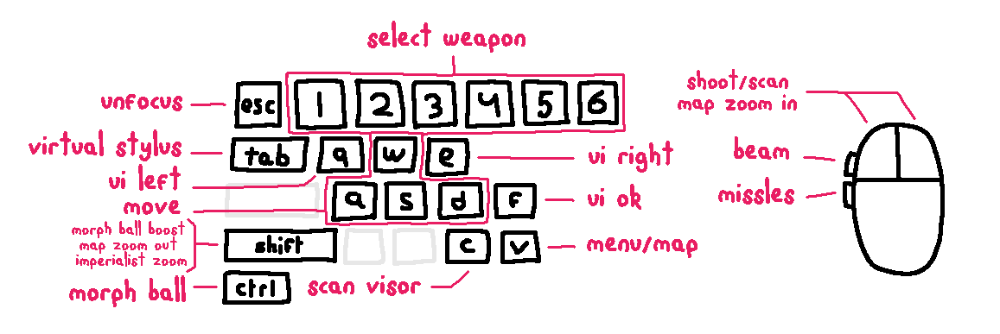

<h1 align="center"><b>melonDS: Metroid Prime Hunters</b></h1>
 
    
Modded version of melonDS emulator to play Metroid Prime Hunters.

It's a bit of a hack but the goal is to make the game as fun as possible using mouse and keyboard.

I originally made this for controller but because there's no lock-on, it wasn't really fun to play.

Please read the instructions carefully.

### Instructions

-   Make sure to set all bindings to `None` in 
    `Config → Input and hotkeys → DS keypad` 
    _(click binding and press backspace)_

-   Find Metroid Prime Hunters related `Keyboard mappings` in 
    `Config → Input and hotkeys → Add-ons (Metroid Prime Hunters)` 
    Recommended defaults have already been set, but feel free to change them if you want to

    Notes:

    -   Focusing the window will capture your mouse. Use `ESC` to release.
    -   The stylus gets placed in the middle of the DS screen for aiming which can cause accidental presses
    -   Whilst holding the virtual stylus button `Tab`, use your mouse to click around on the touchscreen
    -   UI OK `F` will press "OK" on the touch screen, which will also jump and briefly break aiming
    -   UI left `Q` and right `E` will also press on the touch screen, for scan visor messages
    -   When in map view, press `Shift` to zoom out and `LMB` to zoom in

-   Find Metroid Prime Hunters sensitivity settings in 
    `Config → Input and hotkeys → Other Metroid Prime Hunters` 
     
    When in-game, **make sure to set the aim sensitivty to the lowest!** 
    The DS touchscreen isn't very precise, so keep it set to lowest helps 
     
    _Also recommended to set audio settings in-game to headphones_

 

### Optional recommended instructions

-   Enable JIT to improve performance. The game has a low framerate and this helps 
    `Config → Emu settings → CPU emulation → Enable JIT recompiler`

-   Render game at a high resolution 

    -   Disable `Config → Screen filtering` 
    -   `Config → Video settings` 
        Set `3D renderer` to `OpenGL` 
        Disable `VSync` for lower latency 
        Set `Internal resolution` to next highest for your monitor

-   My recommended screen layout 
    `Config → Screen layout → Horizontal` 
    `Config → Screen sizing → Emphasize top` 

-   Bind `Toggle fullscreen` to `F11` or something else 
    `Config → Input and hotkeys → General hotkeys`
